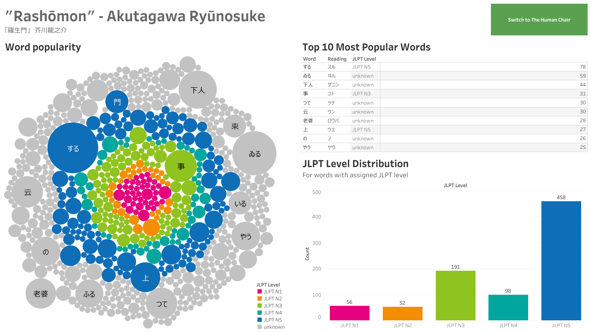

# Aozora Bunko Vocabulary Extractor
This is a Jupyter notebook used to retrieve vocabulary data from books hosted on [Aozora Bunko](https://www.aozora.gr.jp/) - a digital library of classic Japanese literature - and assign the JLPT level to each word. The final data frame is used to create a visual guide to text difficulty for Japanese learners.

## Final Visualisation

*The Tableau dashboard is also available [here](https://public.tableau.com/app/profile/tomasz.jagie.owicz/viz/JapaneseClassicLiteratureJLPTVocabularyAnalysis/Rashomon).*

## Conclusions
This Jupyter notebook provides a quick way to analyse Japanese text in the context of JLPT vocabulary lists, and could be used with other text sources such as show subtitles and game scripts.

As the sample data used for this project is rather dated, there were many words without a JLPT level assigned.

Initially, I used the Jisho API to obtain JLPT level information, but frequent timeouts increased the time it took to process the word list. As an alternative, I decided to use another API with a smaller word base. It is also prone to errors and sometimes does not include basic words, such as いる.