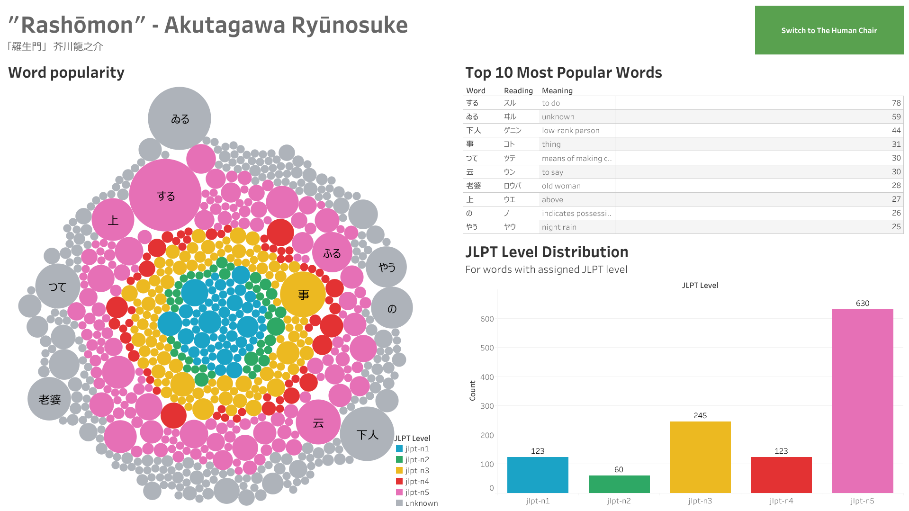

# Aozora Bunko Vocabulary Extractor
This is a Jupyter notebook used to retrieve vocabulary data from books hosted on [Aozora Bunko](https://www.aozora.gr.jp/) - a digital library of classic Japanese literature - and assign the JLPT (Japanese Language Proficiency Test, with N5 being the easiest and N1 being the hardest) level to each word. The final data frame is used to create a visual guide to text difficulty for Japanese learners.

The data gathering process has been documented in this [Jupyter Notebook](./aozora-word-extractor.ipynb)

## Final Visualisation

*The Tableau dashboard is also available [here](https://public.tableau.com/app/profile/tomasz.jagie.owicz/viz/JapaneseClassicLiteratureJLPTVocabularyAnalysis/Rashomon).*

## Conclusions
This Jupyter notebook provides a quick way to analyse Japanese text in the context of JLPT vocabulary lists, and could be used with other text sources such as show subtitles and game scripts.

As the sample data used for this project is rather dated, there were many words without a JLPT level assigned.

In the near future, I would like to build an interactive dashboard that would enable checking the data about various Aozora Bunko text using the same visualisations. 
